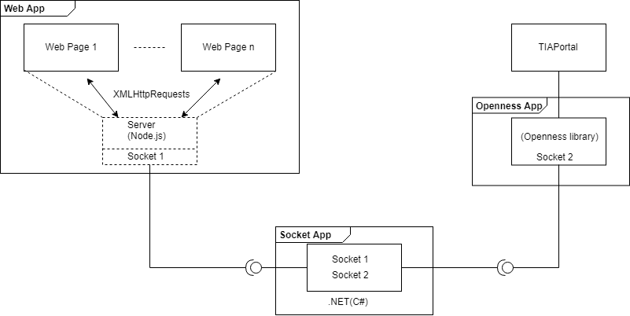

## TIA Portal Cloud Web Application with using Openness

---

#### I. :computer: Introduction

* The aim of the project is creating an application that can control TIA Portal with help of the Openness on web.
A web program, a socket program which contains two sockets and an Openness program are used in project. 
To sum up, web application sends commands to medium socket program after that it sends received commands to Openness program. 
Openness program parses commands and applies on to TIA Portal 
and then it replies to medium socket program in connection with web application.
---

#### II. :house_with_garden: Project Structure

> *Diagram is created by [Emre Onay](https://github.com/onayem)*

---

#### III. :mag_right: [Detailed report of the project](https://github.com/elifkoseler/Openness-Tool/blob/master/docs/Internship%20Report.pdf)

---

> *GNU GENERAL PUBLIC LICENSE*

> *Version 3, 29 June 2007*
